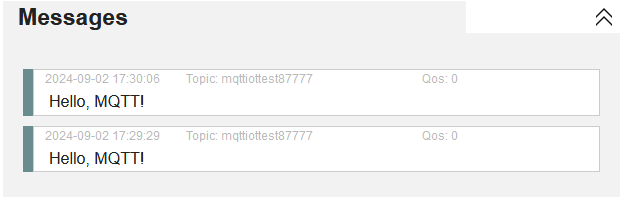
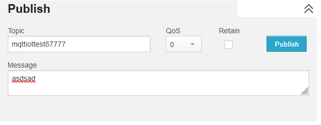
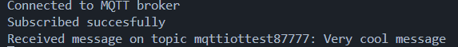
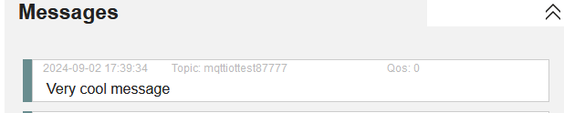
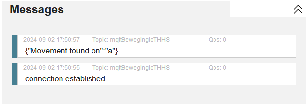
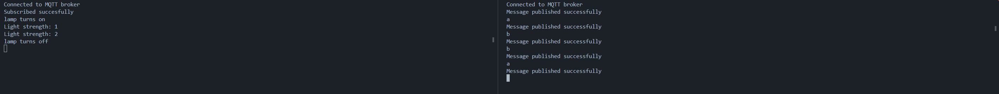
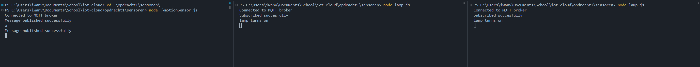

# Practicum 1 - Cloud & Security

1. Run nogmaals opgave1.js. Waar start dit node.js programma? Er is geen main functie. Wanneer stopt het node.js programma en waarom is dit zo?

- Dit programma start boven aan het bestand zolang er code buiten een functie blok staat. Dit programma stopt wanneer alle functies/ code is uitgevoerd.

2. Voeg een timer toe die de print functie aanroept. Wanneer stopt het node.js script nu

- het script stopt nadat de callback van de timer is uitgevoerd

3. Voeg nu een setInterval toe. Wanneer stopt het programma nu

- Het programma stopt wanneer de computer crasht of iemand het programma handmatig uitzet

4. Voeg nu een timer toe die het interval weer cancelt na 20 seconde? Wanneer stopt nu het script?

- Het programma stopt na 20 minuten

5. Het inlezen van keyboard input kan met de volgende code: https://nodejs.org/docs/latest/api/readline.html. Test deze code
```javascript
const readline = require('readline');

const rl = readline.createInterface({
  input: process.stdin,
  output: process.stdout
});

rl.on('line', (input) => {
  console.log(`Received: ${input}`);
});
```
```
What do you think of Node.js?
Thank you for your valuable feedback: very cool
```

6. Waar zit in deze code een anonieme functie

Het volgende stuk code is een anonieme functie:``(answer) => {
  console.log(`Thank you for your valuable feedback: ${answer}`)`` 

7. Herschrijf de code naar een niet anonieme callback functie

```javascript
const readline = require('node:readline');
const { stdin: input, stdout: output } = require('node:process');

const rl = readline.createInterface({ input, output });

function handleInput(answer) {
  console.log(`Thank you for your valuable feedback: ${answer}`);
  rl.close();
}

rl.question('What do you think of Node.js? ', handleInput);
```

8. Blokkeert de question aanroep de event loop? Test dit mbv een timer.

- Nee, dit blokkeert niet de event loop

9. Optioneel: Pas de code zo aan dat je een tweede vervolg vraag stelt
```javascript
const readline = require('readline');

const rl = readline.createInterface({
  input: process.stdin,
  output: process.stdout
});

// very scalable, can even ask more than two questions :)
const questions = ["give answer 1: ", "give answer 2: "];

let index = 0;

// ask question and read in input
function askQuestion() {
  if (index >= questions.length) {
    rl.close();
    process.exit(0);
  }

  rl.question(questions[index], handleInput);
  index++;
}

function handleInput(input) {
  console.log(`Received input: ${input}`);
  askQuestion();
}

// start code
askQuestion();
```
```
give answer 1: antwoord 1
Received input: antwoord 1
give answer 2: antwoord 2
Received input: antwoord 2
```


10. Gebruik de event emitter om meerdere keren invoer van het toetsenbord te lezen. (Event: ‘line’)
```javascript
const readline = require('readline');

const rl = readline.createInterface({
  input: process.stdin,
  output: process.stdout
});

// very scalable, can even ask more than two questions :)
const questions = ["give answer 1: ", "give answer 2: "];

let index = 0;

// ask question and read in input
function askQuestion() {
  if (index >= questions.length) {
    index = 0;
  }

  rl.question(questions[index], handleInput);
  index++;
}

function handleInput(input) {
  console.log(`Received input: ${input}`);
  askQuestion();
}

// start code
askQuestion();
```
```
give answer 1: a
Received input: a
give answer 2: a
Received input: a
give answer 1: aa
Received input: aa
give answer 2: a
Received input: a
give answer 1: a
Received input: a
give answer 2: aa
Received input: aa
give answer 1: aa
Received input: aa
give answer 2: aaa
Received input: aaa
```

11. Laat het programma stoppen als er quit wordt ingetypt
```javascript
const readline = require('readline');

const rl = readline.createInterface({
  input: process.stdin,
  output: process.stdout
});

// very scalable, can even ask more than two questions :)
const questions = ["give answer 1: ", "give answer 2: "];

let index = 0;

// ask question and read in input
function askQuestion() {
  if (index >= questions.length) {
    index = 0;
  }

  rl.question(questions[index], handleInput);
  index++;
}

function handleInput(input) {
  if (input == 'quit') {
    process.exit(0);
  }
  console.log(`Received input: ${input}`);
  askQuestion();
}

// start code
askQuestion();
```
```
give answer 1: quit
PS C:\Users\iwanv\Documents\School\iot-cloud\opdracht1> 
```

12. Maak een simpel programma dat een mqtt bericht published mbv het mqtt package. Test of het bericht is aangekomen via de webpagina van hivemq. 
```javascript
const mqtt = require('mqtt');
const brokerUrl = 'mqtt://broker.hivemq.com';
const topic = 'mqttiottest87777';
const message = 'Hello, MQTT!';
const client = mqtt.connect(brokerUrl);

client.on('connect', () => {
    console.log('Connected to MQTT broker');

    client.publish(topic, message, (error) => {
        if (error) {
            console.error('Failed to publish message:', error);
        } else {
            console.log('Message published successfully');
        }
        client.end();
    });
});
```


13. Maak een andere simpel programma dat een mqtt bericht ontvangt door te subscriben mbv het mqtt package. Publishen van een bericht kan zowel via het programma van de vorige vraag als via de webpagina van hivemq

```javascript
const mqtt = require('mqtt');
const brokerUrl = 'mqtt://broker.hivemq.com';
const topic = 'mqttiottest87777';
const client = mqtt.connect(brokerUrl);

client.on('connect', () => {
    console.log('Connected to MQTT broker');

    client.subscribe(topic, (error) => {
        if (error) {
            console.error('Failed to subscribe to topic:', error);
        } else {
            console.log('Subscribed succesfully');
        }
    });
});

client.on('message', (mtopic, message) => {
    console.log(`Received message on topic ${mtopic}: ${message}`);
});
```

```
Connected to MQTT broker
Subscribed succesfully
Received message on topic mqttiottest87777: asdsad
```

14. Demonstreer nu dat 1 publish bij meerdere subscribers terecht kan komen. Hiermee demonstreer je het publish subscribe pattern



15. Maak een simulated bewegingssensor waarbij het intypen van een toets betekent dat er beweging is geconstateerd. Er wordt dan een JSON bericht via mqtt verstuur
```javascript
const mqtt = require('mqtt');
const readline = require('readline');

const brokerUrl = 'mqtt://broker.hivemq.com';
const topic = 'mqttBewegingIoTHHS';
const client = mqtt.connect(brokerUrl);

client.on('connect', () => {
    console.log('Connected to MQTT broker');

    client.publish(topic, 'connection established', (error) => {
        if (error) {
            console.error('Failed to publish message:', error);
        } else {
            console.log('Message published successfully');
        }
    });

    // Set up readline to listen for key presses
    const rl = readline.createInterface({
        input: process.stdin,
        output: process.stdout
    });

    rl.on('line', (input) => {
        
        client.publish(topic, JSON.stringify({'Movement found on': input}), (error) => {
            if (error) {
                console.error('Failed to publish message:', error);
            } else {
                console.log('Message published successfully');
            }
        });
    });
});
```


16. Maak een simulated Iot lamp (actuator) die aangaat als er beweging is geconstateerd. Via de ontvangen JSON bericht kan de lamp zowel aan met een bepaalde lichtsterkte en ook helemaal uit. Simuleer de lamp door iets te printen.
```javascript
const mqtt = require('mqtt');
const brokerUrl = 'mqtt://broker.hivemq.com';
const topic = 'mqttBewegingIoTHHS';
const client = mqtt.connect(brokerUrl);

let lampAan = false;
let strengthLevel = 0;

client.on('connect', () => {
    console.log('Connected to MQTT broker');

    client.subscribe(topic, (error) => {
        if (error) {
            console.error('Failed to subscribe to topic:', error);
        } else {
            console.log('Subscribed succesfully');
        }
    });
});

function containsValue(obj, value) {
    for (const key in obj) {
        if (obj[key] === value) {
            return true;
        }
    }
    return false;
}

// 'a' turns lamp on or off
// 'b' controls strength
client.on('message', (mtopic, message) => {

    const jsonMessage = JSON.parse(message.toString());
    // console.log(`Received message on topic ${mtopic}:`, jsonMessage);

    if (containsValue(jsonMessage, 'a')) {
        if (lampAan) {
            lampAan = false;
            strengthLevel = 0;
            console.log("lamp turns off")
        }
        else {
            lampAan = true;
            console.log("lamp turns on")
        }
    }
    else if (containsValue(jsonMessage, 'b') && lampAan) {
        strengthLevel++;
        if (strengthLevel > 5)
            strengthLevel = 0;
        console.log('Light strength: ' + strengthLevel)
    }

});
```


17. Zorg dat de lamp automatisch uitgaat na 5 seconden. Maak 2 varianten. Eén variant waarbij de logica (voor het automatisch uitgaan) op de sensor zit en één variant waar de logica op de actuator zit.

Automatisch uitgaan actuator:

```javascript
const mqtt = require('mqtt');
const brokerUrl = 'mqtt://broker.hivemq.com';
const topic = 'mqttBewegingIoTHHS';
const client = mqtt.connect(brokerUrl);

let lampEnabled = false;
let strengthLevel = 0;
let timeoutId;

client.on('connect', () => {
    console.log('Connected to MQTT broker');

    client.subscribe(topic, (error) => {
        if (error) {
            console.error('Failed to subscribe to topic:', error);
        } else {
            console.log('Subscribed succesfully');
        }
    });
});

function containsValue(obj, value) {
    for (const key in obj) {
        if (obj[key] === value) {
            return true;
        }
    }
    return false;
}

function controlLamp(lampBool) {
    if (lampBool) {
        lampEnabled = false;
        strengthLevel = 0;
        console.log("lamp turns off")
    }
    else {
        lampEnabled = true;
        console.log("lamp turns on")
    }
}

// 'a' turns lamp on or off
// 'b' controls strength
client.on('message', (mtopic, message) => {

    const jsonMessage = JSON.parse(message.toString());
    // console.log(`Received message on topic ${mtopic}:`, jsonMessage);

    if (containsValue(jsonMessage, 'a')) {
        controlLamp(lampEnabled)
        // 5 second timer. Gets disabled if lamp gets manually disabled before time is over
        if (lampEnabled && !timeoutId)
            timeoutId = setTimeout(() => controlLamp(true), 5000);
        else if (!lampEnabled && timeoutId) {
            clearTimeout(timeoutId);
            timeoutId = null;
        }
    }
    else if (containsValue(jsonMessage, 'b') && lampEnabled) {
        strengthLevel++;
        if (strengthLevel > 5)
            strengthLevel = 0;
        console.log('Light strength: ' + strengthLevel)
    }

});
```

Automatisch uitgaan Sensor:
```javascript
const mqtt = require('mqtt');
const readline = require('readline');
const conMessage = 'Connection established'
const brokerUrl = 'mqtt://broker.hivemq.com';
const topic = 'mqttBewegingIoTHHS';
const client = mqtt.connect(brokerUrl);

let lampStatus = false;
let timeoutId

function containsValue(obj, value) {
    for (const key in obj) {
        if (obj[key] === value) {
            return true;
        }
    }
    return false;
}

function lampDisabler(lampBool)
{
    lampStatus = false;
    client.publish(topic, JSON.stringify({ 'sending command to disable light': 'a' }), (error) => {
        if (error) {
            console.error('Failed to publish message:', error);
        } else {
            console.log('Message published successfully');
        }
    });
}

client.on('connect', () => {
    console.log('Connected to MQTT broker');

    client.publish(topic, JSON.stringify({ 'Connection Established': conMessage  }), (error) => {
        if (error) {
            console.error('Failed to publish message:', error);
        } else {
            console.log('Message published successfully');
        }
    });

    // Set up readline to listen for key presses
    const rl = readline.createInterface({
        input: process.stdin,
        output: process.stdout
    });

    rl.on('line', (input) => {
        if (containsValue(input, 'a'))
        {
            lampStatus = !lampStatus;

            // code to handle lamp turning off after 5 seconds
            if (lampStatus && !timeoutId)
            {
                timeoutId = setTimeout(() => lampDisabler(), 5000); // Delay in milliseconds
            }
            else if (!lampStatus && timeoutId)
            {
                clearTimeout(timeoutId);
                timeoutId = null;
            }
        }
        client.publish(topic, JSON.stringify({'Movement found on': input}), (error) => {
            if (error) {
                console.error('Failed to publish message:', error);
            } else {
                console.log('Message published successfully');
            }
        });
    });
});
```

18. Welke variant lijkt jou het handigst in de praktijk? Geef een uitleg/

- Ik vind de variant op de lamp zelf het handigst vanaf de programmeerkant gezien. De lamp beheerst dan zelf waardoor die aan of uit kan gaan en de sensor hoeft niet bij te houden of de lamp aan of uit staat.

19. In een lokaal zijn 2 lampen en 1 bewegingssensor. Demonstreer dat je met 1 bewegingssensor 2 lampen kan aansturen zonder je code aan te passen uit de vorige vragen



20. Werk nu samen met een medestudent. Laat jouw lampen aansturen door een bewegingssensor die op de PC van je medestudent draait.

- Kan ik nog niet laten zien

21. In een gang staan nu aan beide kanten een bewegingssensor plaatsen die een lamp aanstuurt. Zodra iemand de gang inloopt (maakt niet uit welke kant) gaat de lamp aan (en na x seconde weer uit). Welke variant van opgave 16 werkt nu altijd goed

- de lamp, door de redenen gegeven in opgave 18.