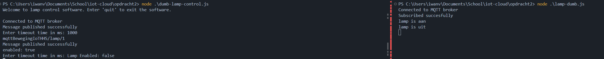

1. Een beheerder wil voor een lamp het het tijdsinterval (in secondes) kunnen aanpassen en ook de maximale lichtsterkte (in procenten). Maak hiervoor een console programma. NB: zorg er wel voor de code uit het vorige practicum blijft werken. Een lamp kan je aansturen op basis van de bewegingssensor.

lamp control:
```js
const mqtt = require('mqtt');
const readline = require('readline');
const conMessage = 'Connection established'
const brokerUrl = 'mqtt://broker.hivemq.com';
const topic = 'mqttBewegingIoTHHS';
const client = mqtt.connect(brokerUrl);

const questions = ["Enter timeout time in ms: ", "Enter lamp strength in percentage: "];

// Set up readline to listen for key presses
const rl = readline.createInterface({
    input: process.stdin,
    output: process.stdout
});

let index = 0;
let jsonMessage;
let timeoutTime;
let lightStrength;

function makeJson() {
    jsonMessage = JSON.stringify({
        "Timeout Time": timeoutTime,
        "Light Strength": lightStrength
    });

    console.log(jsonMessage);
}

// ask question and read in input
function askQuestion() {
    if (index >= questions.length) {
        // publish message
        makeJson();
        client.publish(topic, jsonMessage, (error) => {
            if (error) {
                console.error('Failed to publish message:', error);
            } else {
                console.log('Message published successfully');
            }
        });
        // set index back to 0 to keep repeating the questions
        index = 0;
    }

    rl.question(questions[index], handleInput);
    index++;
}

function handleInput(answer) {
    if (answer == "quit") {
        process.exit(0);
    }
    if (index == 1) {
        timeoutTime = answer;
    }
    else if (index == 2) {
        lightStrength = answer;
    }
    askQuestion();
}

console.log("Welcome to lamp control software. Enter 'quit' to exit the software.");
console.log("Answer -1 to any question to have the lamp not change it's behaviour.");

client.on('connect', () => {
    console.log('Connected to MQTT broker');

    client.publish(topic, JSON.stringify({ 'Connection Established': conMessage }), (error) => {
        if (error) {
            console.error('Failed to publish message:', error);
        } else {
            console.log('Message published successfully');
        }
    });
    askQuestion();

});
```

Lamp: 
```js
const mqtt = require('mqtt');
const readline = require('readline');
const brokerUrl = 'mqtt://broker.hivemq.com';
const topic = 'mqttBewegingIoTHHS';
const client = mqtt.connect(brokerUrl);

let lampEnabled = false;
let strengthLevel = 0;
let timeoutId;
let timeoutTime = 5000;

client.on('connect', () => {
    console.log('Connected to MQTT broker');

    client.subscribe(topic, (error) => {
        if (error) {
            console.error('Failed to subscribe to topic:', error);
        } else {
            console.log('Subscribed succesfully');
        }
    });
});

function containsValue(obj, value) {
    for (const key in obj) {
        if (obj[key] === value) {
            return true;
        }
    }
    return false;
}

function controlLamp(lampBool) {
    if (lampBool) {
        lampEnabled = false;
        strengthLevel = 0;
        console.log("lamp turns off")
        if (timeoutId) {
            clearTimeout(timeoutId)
            timeoutId = null;
        }
    }
    else {
        lampEnabled = true;
        console.log("lamp turns on")
    }
}

// 'a' turns lamp on or off
// 'b' controls strength
client.on('message', (mtopic, message) => {

    const jsonMessage = JSON.parse(message.toString());
    // console.log(`Received message on topic ${mtopic}:`, jsonMessage);

    if (containsValue(jsonMessage, 'a')) {
        controlLamp(lampEnabled)
        // 5 second timer. Gets disabled if lamp gets manually disabled before time is over
        if (lampEnabled && !timeoutId)
            timeoutId = setTimeout(() => controlLamp(true), timeoutTime);
        else if (!lampEnabled && timeoutId) {
            clearTimeout(timeoutId);
            timeoutId = null;
        }
    }
    else if (containsValue(jsonMessage, 'b') && lampEnabled) {
        strengthLevel += 20;
        if (strengthLevel > 100)
            strengthLevel = 0;
        console.log('Light strength: ' + strengthLevel);
    }
    else if ('Timeout Time' in jsonMessage)
    {
        const timeout = parseInt(jsonMessage['Timeout Time']);
        const light = parseInt(jsonMessage['Light Strength']);
        if (timeout >= 0)
            timeoutTime = timeout;
        if (light >= 0 && light <= 100)
            strengthLevel = light;
            
        console.log('time out time: ' + timeoutTime);
        console.log('Light strength: ' + strengthLevel);

        if (lampEnabled && timeoutId)
        {
            clearTimeout(timeoutId);
            timeoutId = null;
            timeoutId = setTimeout(() => controlLamp(true), timeoutTime);
        }
    }

});

// Set up readline to listen for key presses
const rl = readline.createInterface({
    input: process.stdin,
    output: process.stdout
});
```

2. De beheerder zou dit ook graag willen voor alle lampen of alle lampen op een bepaalde verdieping. Maak dit mbv 1 publish en wild cards: https://www.hivemq.com/blog/mqtt-essentials-part-5-mqtt-topics-best-practices

lamp-control:
```js
const mqtt = require('mqtt');
const readline = require('readline');
const conMessage = 'Connection established'
const brokerUrl = 'mqtt://broker.hivemq.com';
const topic = 'mqttBewegingIoTHHS/';
const object = '/lamp';
const client = mqtt.connect(brokerUrl);

const questions = ["Enter what floor you want to control: ",
     "Enter timeout time in ms: ",
      "Enter lamp strength in percentage: "];

// Set up readline to listen for key presses
const rl = readline.createInterface({
    input: process.stdin,
    output: process.stdout
});

let index = 0;
let jsonMessage;
let timeoutTime;
let lightStrength;
let location;
let targetTopic;

function makeMessage() {
    if(location == 'roof' || location == 'ground' || location == 'all')
        targetTopic = topic + location + object;
    else // always send to everything by default >:)
        targetTopic = topic + 'all' + object;
    jsonMessage = JSON.stringify({
        "Timeout Time": timeoutTime,
        "Light Strength": lightStrength
    });

    console.log(jsonMessage);
}

// ask question and read in input
function askQuestion() {
    if (index >= questions.length) {
        // publish message
        makeMessage();
        client.publish(targetTopic, jsonMessage, (error) => {
            if (error) {
                console.error('Failed to publish message:', error);
            } else {
                console.log('Message published successfully');
            }
        });
        // set index back to 0 to keep repeating the questions
        index = 0;
    }

    rl.question(questions[index], handleInput);
    index++;
}

function handleInput(answer) {
    if (answer == "quit") {
        process.exit(0);
    }
    if(index == 1) {
        location = answer;
    }
    if (index == 2) {
        timeoutTime = answer;
    }
    else if (index == 3) {
        lightStrength = answer;
    }
    askQuestion();
}

console.log("Welcome to lamp control software. Enter 'quit' to exit the software.");
console.log("availabe floors: ground, roof, all");
console.log("Answer -1 to any question to have the lamp not change it's behaviour.");

client.on('connect', () => {
    console.log('Connected to MQTT broker');

    client.publish(topic, JSON.stringify({ 'Connection Established': conMessage }), (error) => {
        if (error) {
            console.error('Failed to publish message:', error);
        } else {
            console.log('Message published successfully');
        }
    });
    askQuestion();

});
```

grond lamp:
```js
const mqtt = require('mqtt');
const readline = require('readline');
const brokerUrl = 'mqtt://broker.hivemq.com';
const topic = 'mqttBewegingIoTHHS/ground/lamp';
const topic2 = 'mqttBewegingIoTHHS/all/lamp';
const client = mqtt.connect(brokerUrl);

let lampEnabled = false;
let strengthLevel = 0;
let timeoutId;
let timeoutTime = 5000;

client.on('connect', () => {
    console.log('Connected to MQTT broker');

    client.subscribe(topic, (error) => {
        if (error) {
            console.error('Failed to subscribe to topic:', error);
        } else {
            console.log('Subscribed succesfully');
        }
    });
    client.subscribe(topic2, (error) => {
        if (error) {
            console.error('Failed to subscribe to topic:', error);
        } else {
            console.log('Subscribed succesfully');
        }
    });
});

function containsValue(obj, value) {
    for (const key in obj) {
        if (obj[key] === value) {
            return true;
        }
    }
    return false;
}

function controlLamp(lampBool) {
    if (lampBool) {
        lampEnabled = false;
        strengthLevel = 0;
        console.log("lamp turns off")
        if (timeoutId) {
            clearTimeout(timeoutId)
            timeoutId = null;
        }
    }
    else {
        lampEnabled = true;
        console.log("lamp turns on")
    }
}

// 'a' turns lamp on or off
// 'b' controls strength
client.on('message', (mtopic, message) => {

    const jsonMessage = JSON.parse(message.toString());
    // console.log(`Received message on topic ${mtopic}:`, jsonMessage);

    if (containsValue(jsonMessage, 'a')) {
        controlLamp(lampEnabled)
        // 5 second timer. Gets disabled if lamp gets manually disabled before time is over
        if (lampEnabled && !timeoutId)
            timeoutId = setTimeout(() => controlLamp(true), timeoutTime);
        else if (!lampEnabled && timeoutId) {
            clearTimeout(timeoutId);
            timeoutId = null;
        }
    }
    else if (containsValue(jsonMessage, 'b') && lampEnabled) {
        strengthLevel += 20;
        if (strengthLevel > 100)
            strengthLevel = 0;
        console.log('Light strength: ' + strengthLevel);
    }
    else if ('Timeout Time' in jsonMessage)
    {
        const timeout = parseInt(jsonMessage['Timeout Time']);
        const light = parseInt(jsonMessage['Light Strength']);
        if (timeout >= 0)
            timeoutTime = timeout;
        if (light >= 0 && light <= 100)
            strengthLevel = light;
            
        console.log('time out time: ' + timeoutTime);
        console.log('Light strength: ' + strengthLevel);

        if (lampEnabled && timeoutId)
        {
            clearTimeout(timeoutId);
            timeoutId = null;
            timeoutId = setTimeout(() => controlLamp(true), timeoutTime);
        }
    }

});

// Set up readline to listen for key presses
const rl = readline.createInterface({
    input: process.stdin,
    output: process.stdout
});
```

dak lamp:
```js
const mqtt = require('mqtt');
const readline = require('readline');
const brokerUrl = 'mqtt://broker.hivemq.com';
const topic = 'mqttBewegingIoTHHS/roof/lamp';
const topic2 = 'mqttBewegingIoTHHS/all/lamp';
const client = mqtt.connect(brokerUrl);

let lampEnabled = false;
let strengthLevel = 0;
let timeoutId;
let timeoutTime = 5000;

client.on('connect', () => {
    console.log('Connected to MQTT broker');

    client.subscribe(topic, (error) => {
        if (error) {
            console.error('Failed to subscribe to topic:', error);
        } else {
            console.log('Subscribed succesfully');
        }
    });
    client.subscribe(topic2, (error) => {
        if (error) {
            console.error('Failed to subscribe to topic:', error);
        } else {
            console.log('Subscribed succesfully');
        }
    });
});

function containsValue(obj, value) {
    for (const key in obj) {
        if (obj[key] === value) {
            return true;
        }
    }
    return false;
}

function controlLamp(lampBool) {
    if (lampBool) {
        lampEnabled = false;
        strengthLevel = 0;
        console.log("lamp turns off")
        if (timeoutId) {
            clearTimeout(timeoutId)
            timeoutId = null;
        }
    }
    else {
        lampEnabled = true;
        console.log("lamp turns on")
    }
}

// 'a' turns lamp on or off
// 'b' controls strength
client.on('message', (mtopic, message) => {

    const jsonMessage = JSON.parse(message.toString());
    // console.log(`Received message on topic ${mtopic}:`, jsonMessage);

    if (containsValue(jsonMessage, 'a')) {
        controlLamp(lampEnabled)
        // 5 second timer. Gets disabled if lamp gets manually disabled before time is over
        if (lampEnabled && !timeoutId)
            timeoutId = setTimeout(() => controlLamp(true), timeoutTime);
        else if (!lampEnabled && timeoutId) {
            clearTimeout(timeoutId);
            timeoutId = null;
        }
    }
    else if (containsValue(jsonMessage, 'b') && lampEnabled) {
        strengthLevel += 20;
        if (strengthLevel > 100)
            strengthLevel = 0;
        console.log('Light strength: ' + strengthLevel);
    }
    else if ('Timeout Time' in jsonMessage)
    {
        const timeout = parseInt(jsonMessage['Timeout Time']);
        const light = parseInt(jsonMessage['Light Strength']);
        if (timeout >= 0)
            timeoutTime = timeout;
        if (light >= 0 && light <= 100)
            strengthLevel = light;
            
        console.log('time out time: ' + timeoutTime);
        console.log('Light strength: ' + strengthLevel);

        if (lampEnabled && timeoutId)
        {
            clearTimeout(timeoutId);
            timeoutId = null;
            timeoutId = setTimeout(() => controlLamp(true), timeoutTime);
        }
    }

});

// Set up readline to listen for key presses
const rl = readline.createInterface({
    input: process.stdin,
    output: process.stdout
});
```

resultaat:


3. We willen een simulated alarmlicht maken. De heeft een knipperfrequentie en een instelbare kleur. Om een realistischer simulated device te maken is de volgende code gegeven (niet verplicht). Hiervoor moet je een (oudere versie van chalk) installeren via: npm install chalk@4.1.2. Run deze code.


4. Maak een simulated alarmlicht dat je kan aanzetten via mqtt met een bepaalde knipperfrequentie (in msec) en kleur (RGB waarde). Ook uitzetten kan. Beschrijf hiervoor een JSON structuur zodat iemand anders weet hoe je het alarmlicht kan aansturen als je deze JSON verstuurd via mqtt. Test het device via hivemq dashboard

JSON structuur: 
```json
{
    "enable": true,
    "blinkDelayMs": 500,
    "rgbValue": {
        "red": 255,
        "green": 0,
        "blue": 0
    }
}
```

code:

```js
const chalk = require('chalk');
const mqtt = require('mqtt');
const { stdin: input, stdout: output } = require('node:process');
const topic = 'mqttBewegingIoTHHS/knipperlamp';
const brokerUrl = 'mqtt://broker.hivemq.com';
const client = mqtt.connect(brokerUrl);

let intervalId;

let blinkDelay = 1000;
let rgbValue = [0, 255, 0]

process.stdout.write('aan');
toggle = false;
// intervalId = setInterval(print, blinkDelay);

function print() {
    process.stdout.cursorTo(0);
    if (toggle) {
        process.stdout.write("   ");
    }
    else {
        process.stdout.write(chalk.rgb(rgbValue[0], rgbValue[1], rgbValue[2])("aan"));
    }
    toggle = (!toggle);
}


client.on('connect', () => {
    console.log('Connected to MQTT broker');

    client.subscribe(topic, (error) => {
        if (error) {
            console.error('Failed to subscribe to topic:', error);
        } else {
            console.log('Subscribed succesfully');
        }
    });
});

client.on('message', (mtopic, message) => {

    clearInterval(intervalId);
    intervalId = null;

    const jsonMessage = JSON.parse(message.toString());
    console.log(`Received message on topic ${topic}:`, jsonMessage);

    if ('enable' in jsonMessage) {
        const enable = jsonMessage['enable'];
        console.log(`Enable: ${enable}`);

        if (!enable)
            return;
    }
    else {
        console.log("error: enabled not found.");
        return;
    }

    if ('blinkDelayMs' in jsonMessage) {
        blinkDelay = jsonMessage['blinkDelayMs'];
        console.log(`Blink Delay (ms): ${blinkDelay}`);
    }
    else {
        console.log("error: blinkDelayMs not found.")
        return;
    }

    if ('rgbValue' in jsonMessage) {
        const rgb = jsonMessage['rgbValue'];
        console.log(`RGB Value ${rgb}`);
        rgbValue[0] = rgb['red'];
        rgbValue[1] = rgb['green'];
        rgbValue[2] = rgb['blue'];
        console.log(`RGB Value - Red: ${rgbValue[0]}, Green: ${rgbValue[1]}, Blue: ${rgbValue[2]}`);
    }
    else {
        console.log("error: rgbValue not found.")
        return;
    }

    intervalId = setInterval(print, blinkDelay);
});
```

resultaat:


5. Test je JSON beschrijving door een medestudent via het hive mqtt dasboard een JSON bericht te versturen volgens jouw definitie. Wordt het alarmlicht correct aangestuurd? Wat gebeurt er als iemand een “verkeerd” bericht verstuurd? Pas de code zonodig aan voor correct fouthandeling. 


Als iemand een verkeerd bericht verstuurd dan geeft de code aan dat hij een onderdeel van het bericht niet kan vinden en verlaat hij de functie.

6. We gaan nu een service maken met logica. Vaak koop je een Iot device waarvan je code niet kan aanpassen en de fabrikant maar beperkte instelmogelijkheden aanbiedt. Willen nog steeds via een bewegingsensor een lamp aansturen en willen dat de lamp na een bepaald interval uitgaat. echter zowel een lampen als bewegingssensoren zonder enige timer zijn veel goedkoper. De enige instel mogelijkheid is: broker en topic. Maak nu een service die een bericht van een bewegingssensor doorstuurt naar lamp en lamp ook weer uitdoet

controller:

```js
const mqtt = require('mqtt');
const readline = require('readline');
const conMessage = 'Connection established'
const brokerUrl = 'mqtt://broker.hivemq.com';
const topic = 'mqttBewegingIoTHHS/lamp/';
const client = mqtt.connect(brokerUrl);

const questions = ["Enter timeout time in ms: "];

// Set up readline to listen for key presses
const rl = readline.createInterface({
    input: process.stdin,
    output: process.stdout
});

let lampEnabled = false;
let index = 0;
let location = "1";
let jsonMessage;
let timeoutTime;
let timeoutId;
let targetTopic;

function makeTopic() {
    targetTopic = topic + location;
    console.log(targetTopic);
}

function sendMessage() {
    // publish message
    client.publish(targetTopic, "hi :)", (error) => {
        if (error) {
            console.error('Failed to publish message:', error);
        } else {
            console.log('Message published successfully');
        }
    });
}

function lampLogic() {
    lampEnabled = !lampEnabled;

    if (lampEnabled) {
        if (timeoutId) {
            clearTimeout(timeoutId);
            timeoutId = null;
        }
    }
    else if (timeoutId) {
        clearTimeout(timeoutId);
        timeoutId = null;
    }

    console.log("enabled: " + lampEnabled);

    timeoutId = setTimeout(() => {
        client.publish(targetTopic, "hi :(")
        lampEnabled = !lampEnabled;
        console.log("Lamp Enabled: " + lampEnabled);
    }, timeoutTime)
}

// ask question and read in input
function askQuestion() {
    if (index >= questions.length) {
        makeTopic();

        sendMessage();

        lampLogic();

        // set index back to 0 to keep repeating the questions
        index = 0;
    }

    rl.question(questions[index], handleInput);
    index++;
}

function handleInput(answer) {
    if (answer == "quit") {
        process.exit(0);
    }
    try {
        timeoutTime = parseInt(answer);
    }
    catch {
        console.log("you didn't enter a number and I can't deal with that. Exiting program.")
        process.exit(0);
    }
    askQuestion();

}

console.log("Welcome to lamp control software. Enter 'quit' to exit the software.");
console.log("");

client.on('connect', () => {
    console.log('Connected to MQTT broker');

    client.publish(topic, JSON.stringify({ 'Connection Established': conMessage }), (error) => {
        if (error) {
            console.error('Failed to publish message:', error);
        } else {
            console.log('Message published successfully');
        }
    });
    askQuestion();

});
```

lamp:

```js
const mqtt = require('mqtt');
const readline = require('readline');
const brokerUrl = 'mqtt://broker.hivemq.com';
const topic = 'mqttBewegingIoTHHS/lamp/1';
const client = mqtt.connect(brokerUrl);

let lampEnabled = false;

client.on('connect', () => {
    console.log('Connected to MQTT broker');

    client.subscribe(topic, (error) => {
        if (error) {
            console.error('Failed to subscribe to topic:', error);
        } else {
            console.log('Subscribed succesfully');
        }
    });
});


// 'a' turns lamp on or off
// 'b' controls strength
client.on('message', (mtopic) => {
    lampEnabled = !lampEnabled;
    console.log(`lamp is ${lampEnabled ? 'aan' : 'uit'}`);

});

// Set up readline to listen for key presses
const rl = readline.createInterface({
    input: process.stdin,
    output: process.stdout
});
```

resultaat:



7. Stel men wil dat de lampen alleen aangestuurd worden tijdens kantoren en de donkere maanden van het jaar. Welke code hoef je nu aan te passen?

    Hiervoor hoeft alleen de code in de controller aangepast te worden.

8. Maak een eigen broker in de Cloud aan. NB: Hivemq gebruikt hiervoor AWS of Azur

    👍

9. Maak een opstelling met 2 lampen en een bewegingssensor die TLS en authenticatie gebruiken met de net aangemaakte broker.

de sensor:

```js
const mqtt = require('mqtt');
const readline = require('readline');
const topic = 'mqttBewegingIoTHHS/lamp/1';

// Set up readline to listen for key presses
const rl = readline.createInterface({
    input: process.stdin,
    output: process.stdout
});

const options = {
    protocol: 'mqtts',
    host: '7be1e893c3aa437b88105626415cac26.s1.eu.hivemq.cloud',
    port: 8883,
    username: 'iwan1',
    password: 'Iwan1234'
};

const client = mqtt.connect(options);

let lampEnabled = false;

client.on('connect', () => {
    console.log('Connection established');

    client.subscribe(topic, (error) => {
        if (error) {
            console.error('Failed to subscribe to topic:', error);
        } else {
            console.log('Subscribed successfully');
        }
    });
});

rl.on('line', (input) => {

    client.publish(topic, input, (error) => {
        if (error) {
            console.error('Failed to publish message:', error);
        } else {
            console.log('Message published successfully');
        }
    });
});
```

de lamp:
```js
const mqtt = require('mqtt');
const readline = require('readline');
// const brokerUrl = 'mqtts://broker.hivemq.com';
const topic = 'mqttBewegingIoTHHS/lamp/1';

const options = {
    protocol: 'mqtts',
    host: '7be1e893c3aa437b88105626415cac26.s1.eu.hivemq.cloud',
    port: 8883,
    username: 'iwan1',
    password: 'Iwan1234'
};

const client = mqtt.connect(options);

let lampEnabled = false;

client.on('connect', () => {
    console.log('Connection established');

    client.subscribe(topic, (error) => {
        if (error) {
            console.error('Failed to subscribe to topic:', error);
        } else {
            console.log('Subscribed successfully');
        }
    });
});

// 'a' turns lamp on or off
// 'b' controls strength
client.on('message', (mtopic) => {
    lampEnabled = !lampEnabled;
    console.log(`lamp is ${lampEnabled ? 'aan' : 'uit'}`);
});

// Set up readline to listen for key presses
const rl = readline.createInterface({
    input: process.stdin,
    output: process.stdout
});
```

    

10. Optioneel: maak voor de lamp en bewegingssensor een eigen permission zodat het least amount of privilege geldt.  Wat is het voordeel hiervan? Zie documentatie van hivemq hoe topic permission werkt.

    Het voordeel hiervan is dat als iemand op de één of andere manier toegang krijgt tot één van deze apparaten ze of alleen maar kunnen lezen of alleen maar kunnen sturen. Dit zorgt ervoor dat de hacker minder kan doen in het netwerk dan als alle apparaten volle toegang hadden.