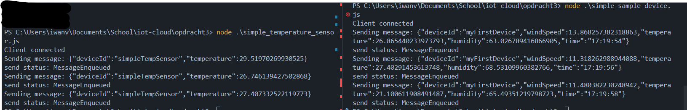
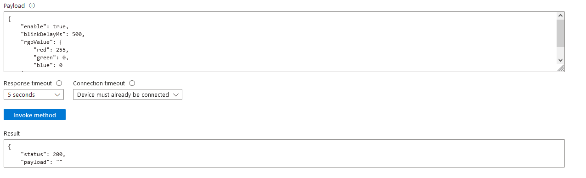

1. Registreer een device via de Azure dasboard of cli. Hierdoor krijg je een connection string

    

2. De Azure Iot Explorer hoef je niet te installeren. Alles kan je ook doen via portal.azure.com. Hierin zit ook een CLI voor de az commando’s

    done

3. Maak een Iot device die telemetry verstuurt. Gebruik uit de voorbeeld code van git: device/samples/javascript/simple_sample_device.js. Deze code is simpeler dan: pnp_temperature_controller.js. Vergeet voor het runnen niet de npm install voor de packages

```js
// Copyright (c) Microsoft. All rights reserved.
// Licensed under the MIT license. See LICENSE file in the project root for full license information.

'use strict';

require('dotenv').config({path: './simple_env.env'});

const Protocol = require('azure-iot-device-mqtt').Mqtt;


const Client = require('azure-iot-device').Client;
const Message = require('azure-iot-device').Message;

const deviceConnectionString = process.env.IOTHUB_DEVICE_CONNECTION_STRING;
let sendInterval;

function disconnectHandler() {
    clearInterval(sendInterval);
    sendInterval = null;
    client.open().catch((err) => {
        console.error(err.message);
    });
}

function messageHandler(msg) {
    console.log('Id: ' + msg.messageId + ' Body: ' + msg.data);
    client.complete(msg, printResultFor('completed'));
}

function generateMessage() {
    const windSpeed = 10 + (Math.random() * 4); // range: [10, 14]
    const temperature = 20 + (Math.random() * 10); // range: [20, 30]
    const humidity = 60 + (Math.random() * 20); // range: [60, 80]
    const data = JSON.stringify({ deviceId: 'myFirstDevice', windSpeed: windSpeed, temperature: temperature, humidity: humidity });
    const message = new Message(data);
    message.properties.add('temperatureAlert', (temperature > 28) ? 'true' : 'false');
    return message;
}

function errorHandler(err) {
    console.error(err.message);
}

function connectHandler() {
    console.log('Client connected');
    // Create a message and send it to the IoT Hub every two seconds
    if (!sendInterval) {
        sendInterval = setInterval(() => {
            const message = generateMessage();
            console.log('Sending message: ' + message.getData());
            client.sendEvent(message, printResultFor('send'));
        }, 2000);
    }
}

// fromConnectionString must specify a transport constructor, coming from any transport package.
let client = Client.fromConnectionString(deviceConnectionString, Protocol);

client.on('connect', connectHandler);
client.on('error', errorHandler);
client.on('disconnect', disconnectHandler);
client.on('message', messageHandler);

client.open()
    .catch((err) => {
        console.error('Could not connect: ' + err.message);
    });

// Helper function to print results in the console
function printResultFor(op) {
    return function printResult(err, res) {
        if (err) console.log(op + ' error: ' + err.toString());
        if (res) console.log(op + ' status: ' + res.constructor.name);
    };
}
```

p.s. de npm package azure-iot-device-mqtt is deprecated en heeft memory leaks.

3. Controleer of er berichten aankomen op de Iot Hub: Gebruik hier voor het CLI commando. Noteer dit commando ook. Welke informatie ontvang je? En van welk device is deze afkomstig. Is deze informatie consistent?

    
    

4. Welke 4 events kan je krijgen uit de client class? En welke zijn er gebruikt bij de test uit de vorige vraag?

    ```
    connect
    error
    disconnect
    message
    ```

    Bij de vorige opdracht is connect gebruikt.

5. Pas het bericht dat je verstuurd aan zodat er ook het tijdstip van de meting in staat. En test of dit goed werkt.

```js
function generateMessage() {
    const windSpeed = 10 + (Math.random() * 4); // range: [10, 14]
    const temperature = 20 + (Math.random() * 10); // range: [20, 30]
    const humidity = 60 + (Math.random() * 20); // range: [60, 80]
    const time = new Date().toLocaleTimeString(); // <---------------- Time added here
    const data = JSON.stringify({ deviceId: 'myFirstDevice', windSpeed: windSpeed, temperature: temperature, humidity: humidity, time : time });
    const message = new Message(data);
    message.properties.add('temperatureAlert', (temperature > 28) ? 'true' : 'false');
    return message;
}
```


6. Maak een 2e sensor die alleen de temperatuur verstuurt in JSON. Haal alle code uit het oorspronkelijke sample weg die niet nodig is (dode code) . Test nu beide sensors.

nieuwe temperatuur sensor:
```js
'use strict';

require('dotenv').config({ path: './simple_env.env' });

// Choose a protocol by uncommenting one of these transports.
const Protocol = require('azure-iot-device-mqtt').Mqtt;
const Client = require('azure-iot-device').Client;
const Message = require('azure-iot-device').Message;

const deviceConnectionString = process.env.IOTHUB_TEMPSENSOR_CONNECTION_STRING;
let sendInterval;

function generateMessage() {
    const temperature = 20 + (Math.random() * 10); // range: [20, 30]
    const data = JSON.stringify({ deviceId: 'simpleTempSensor', temperature: temperature, });
    const message = new Message(data);
    message.properties.add('temperatureAlert', (temperature > 28) ? 'true' : 'false');
    return message;
}

function connectHandler() {
    console.log('Client connected');
    // Create a message and send it to the IoT Hub every two seconds
    if (!sendInterval) {
        sendInterval = setInterval(() => {
            const message = generateMessage();
            console.log('Sending message: ' + message.getData());
            client.sendEvent(message, printResultFor('send'));
        }, 2000);
    }
}

// fromConnectionString must specify a transport constructor, coming from any transport package.
let client = Client.fromConnectionString(deviceConnectionString, Protocol);

client.on('connect', connectHandler);

client.open()
    .catch((err) => {
        console.error('Could not connect: ' + err.message);
    });

// Helper function to print results in the console
function printResultFor(op) {
    return function printResult(err, res) {
        if (err) console.log(op + ' error: ' + err.toString());
        if (res) console.log(op + ' status: ' + res.constructor.name);
    };
}
```



7. Als je kijkt in de reference bij de Message class dan zie je dat je ook kan aangeven dat er JSON wordt verstuurd. Pas de code van de 1e sensor aan en test het effect.

```js
function generateMessage() {
    const windSpeed = 10 + (Math.random() * 4); // range: [10, 14]
    const temperature = 20 + (Math.random() * 10); // range: [20, 30]
    const humidity = 60 + (Math.random() * 20); // range: [60, 80]
    const time = new Date().toLocaleTimeString();    const data = JSON.stringify({ deviceId: 'myFirstDevice', windSpeed: windSpeed, temperature: temperature, humidity: humidity, time : time });
    const message = new Message(data);
    message.contentType='application/json';
    message.properties.add('temperatureAlert', (temperature > 28) ? 'true' : 'false');
    return message;
}
```

8. Kopieer devices_methods.js. Dit is een simulated Iot Deur device

        

9. Welke 2 direct methodes biedt dit script aan?

    'lockDoor' en 'getDeviceLog'

10. Maak een service die deze direct methods aan roept (baseer je op (device_method.js uit de service sdk samples). Blijf voor de connection de environment variabele gebruiken (ivm security). Test dat je de Iot deur via deze service kan openen en sluiten

```js
'use strict';


require('dotenv').config({ path: './simple_env.env' });

const readline = require('readline');

// Set up readline to listen for key presses
const rl = readline.createInterface({
    input: process.stdin,
    output: process.stdout
});

var answer1;
var answer2;

var Client = require('azure-iothub').Client;

var connectionString = process.env.IOTHUB_CONNECTION_STRING;
var targetDevice = process.env.IOTHUB_DEVICE_ID;
var methodParams //= {
//     methodName: process.env.IOTHUB_METHOD_NAME,
//     payload: process.env.IOTHUB_METHOD_PAYLOAD,
//     responseTimeoutInSeconds: 15 // set response timeout as 15 seconds
// };


let index = 0;

const questions = ["Method? ", "payload? "];

// ask question and read in input
function askQuestion() {
    if (index >= questions.length) {
        // create methodParams
        methodParams = {
            methodName: answer1,
            payload: answer2,
            responseTimeoutInSeconds: 15 // set response timeout as 15 seconds
        };

        client.invokeDeviceMethod(targetDevice, methodParams, function (err, result) {
            if (err) {
                console.error('Failed to invoke method \'' + methodParams.methodName + '\': ' + err.message);
            } else {
                console.log(methodParams.methodName + ' on ' + targetDevice + ':');
                console.log(JSON.stringify(result, null, 2));

                methodParams = {
                    methodName: null,
                    payload: null,
                    responseTimeoutInSeconds: 15 // set response timeout as 15 seconds
                };
            }
        });

        // set index back to 0 to keep repeating the questions
        index = 0;
    }

    rl.question(questions[index], handleInput);
    index++;
}

function handleInput(answer) {
    if (answer == "quit") {
        process.exit(0);
    }
    if (index == 1) {
        if (answer == 'getDeviceLog' || answer == 'lockDoor')
            answer1 = answer;
    }
    if (index == 2) {
        answer2 = answer;
    }
    askQuestion();
}

askQuestion();

var client = Client.fromConnectionString(connectionString);
```


11. Pas de code van de Iot deur aan zodat je kan opvragen of de deur open of dicht is. Deze response ontvang je als JSON

```js
function onGetDeviceLog(request, response) {
    printDeviceMethodRequest(request);

    var responseMessage;

    if (open) {
        responseMessage = JSON.stringify({ doorStatus: 'open' });
    }
    else {
        responseMessage = JSON.stringify({ doorStatus: 'closed' });
    }

    // complete the response
    response.send(200, responseMessage, function (err) {
        if (err) {
            console.error('An error ocurred when sending a method response:\n' +
                err.toString());
        } else {
            console.log(responseMessage);
        }
 
```


12. Pas de code zo aan dat je via 1 direct method de deur kan openen of sluiten. De parameter geeft aan of de deur gesloten moet worden of geopend. Ook deze parameter is JSON. Ook geeft de deur een antwoord: deur geopend, of ik was al geopend, deur gesloten enz.

Service kant:

```js

function handleInput(answer) {
    if (answer == "quit") {
        process.exit(0);
    }
    if (index == 1) {
        if (answer == 'getDeviceLog' || answer == 'lockDoor')
            answer1 = answer;
    }
    if (index == 2) {
        if (answer1 == 'lockDoor') {
            if (answer == 'open' || answer == 'close') {
                answer2 = JSON.stringify( {'status' : answer} );
            }
            else {
                console.log("enter either open or close");
                index--;
            }
        }
        else
            answer2 = answer;
    }
    askQuestion();
}
```

device kant:

```js
function onLockDoor(request, response) {
    printDeviceMethodRequest(request);

    var responseMessage = "";

    var parsedMessage = JSON.parse(request.payload);

    // if (request.payload.includes('open')) {
    if(parsedMessage.status == 'open') {
        if (open) {
            responseMessage = "door is already open";
        }
        else {
            responseMessage = "opening door";
            open = true;
        }
    }
    else if(parsedMessage.status == 'close') {
        if (!open) {
            responseMessage = "door is already closed";
        }
        else {
            responseMessage = "closing door";
            open = false;
        }
    }

    console.log("response Message: " + responseMessage)


    // complete the response
    response.send(200, responseMessage, function (err) {
        if (err) {
            console.error('An error ocurred when sending a method response:\n' +
                err.toString());
        } else {
            console.log('Response to method \'' + request.methodName +
                '\' sent successfully.');
        }
    });
}
```


13. Maak een simulated alarmlicht dat je kan aanzetten met een bepaalde knipperfrequentie (in msec) en kleur (RGB waarde) die verbonden is met de Azure Iot Hub. Functioneel doet deze hetzelfde als het alarmlicht uit practicum 2. Ook mag in dit simulated device geen dode code zitten

```js
'use strict';
require('dotenv').config({ path: './simple_env.env' });

const Protocol = require('azure-iot-device-mqtt').Mqtt;
const Client = require('azure-iot-device').Client;
let client = null;
let intervalId;
const chalk = require('chalk');

let blinkDelay = 1000;
let rgbValue = [0, 255, 0]
var toggle = false;

function main() {
    // open a connection to the device
    const deviceConnectionString = process.env.IOTHUB_DEVICE_CONNECTION_STRING;
    client = Client.fromConnectionString(deviceConnectionString, Protocol);
    // eslint-disable-next-line security/detect-non-literal-fs-filename
    client.open(onConnect);
}

function onConnect(err) {
    if (err) {
        console.error('Could not connect: ' + err.message);
    } else {
        console.log('Connected to device. Registering handlers for methods.');

        // register handlers for all the method names we are interested in
        client.onDeviceMethod('toggleEffect', onToggleEffect);
    }
}

function print() {
    process.stdout.cursorTo(0);
    if (toggle) {
        process.stdout.write("   ");
    }
    else {
        process.stdout.write(chalk.rgb(rgbValue[0], rgbValue[1], rgbValue[2])("aan"));
    }
    toggle = (!toggle);
}

function printDeviceMethodRequest(request) {
    // print method name
    console.log('Received method call for method \'' + request.methodName + '\'');

    // if there's a payload just do a default console log on it
    if (request.payload) {
        console.log('Payload:\n' + request.payload);
    }
}


function onToggleEffect(request, response) {
    printDeviceMethodRequest(request);

    var responseMessage = "";
    clearInterval(intervalId);
    intervalId = null;

    if (request.payload.enable) {
        const enable = request.payload.enable;
        console.log(`Enable: ${enable}`);

        if (!enable)
            return;
    }
    else {
        console.log("error: enabled not found.");
        return;
    }

    if (request.payload.blinkDelayMs) {
        blinkDelay = request.payload.blinkDelayMs;
        console.log(`Blink Delay (ms): ${blinkDelay}`);
    }
    else {
        console.log("error: blinkDelayMs not found.")
        return;
    }

    if (request.payload.rgbValue) {
        const rgb = request.payload.rgbValue;
        console.log(`RGB Value ${rgb}`);
        rgbValue[0] = rgb['red'];
        rgbValue[1] = rgb['green'];
        rgbValue[2] = rgb['blue'];
        console.log(`RGB Value - Red: ${rgbValue[0]}, Green: ${rgbValue[1]}, Blue: ${rgbValue[2]}`);
    }
    else {
        console.log("error: rgbValue not found.")
        return;
    }

    intervalId = setInterval(print, blinkDelay);

    // complete the response
    response.send(200, responseMessage, function (err) {
        if (err) {
            console.error('An error ocurred when sending a method response:\n' +
                err.toString());
        } else {
            console.log(responseMessage);
        }
    });

}

// program

main();

process.stdout.write("aan");
toggle = false;
intervalId = setInterval(print, 1000);
```




14. Je kan een Iot Device ook via de CLI testen. Je hoeft dan geen backend te hebben. Zie CLI reference: https://docs.microsoft.com/en-us/cli/azure/iot/hub?view=azure-cli-latest#az-iot-hub-invoke-device-method Test zowel de deur als het alarmlicht


15. Laat jouw de Iot deur ook testen door een medestudent. Hij moet nu dus verbinding kunnen maken met jouw Iot Hub door het runnen van de service die eerder gemaakt hebt. Bedenk welke gegevens je nog meer moet delen.


16. 