### Opdracht 1: HTTP Trigger Function

1. Maak een 2e functie die een andere parameter uit de querystring verwacht. Geef een 500 status code terug als deze parameter ontbreekt. Maak zowel een log melding en return een body met tekst.

```js
const { app } = require('@azure/functions');

app.http('parameter', {
    methods: ['GET', 'POST'],
    authLevel: 'anonymous',
    handler: async (request, context) => {
        context.log(`Http function processed request for url "${request.url}"`);

        const name = request.query.get('name')// || await request.text() || 'world';
        if(name === null) {
            context.log("Error. Name is empty.")
            return {
                status : 500,
                body : "Error. Name is empty"
            }
        } 

        return { body: `Hello, ${name}!` };
    }
});
```

2. Waarom staat er een await keyword als je iets leest uit de request body?

    Dit is omdat het ophalen van het ophalen van een body van een HTTP-request een asynchrone operatie is.

3. Deploy deze function naar Azure met de CLI. Schrijf alle commando’s op. Test vervolgens deze function. Waar verschijnen nu log meldingen?

```

az login

az group create --name cloud-practicum-4 --location westeurope

az storage account create --name cloudpracticum4 --location westeurope --resource-group cloud-practicum-4 --sku Standard_LRS --allow-blob-public-access false

az functionapp create --resource-group cloud-practicum-4 --consumption-plan-location westeurope --runtime node --runtime-version 18 --functions-version 4 --name practicum4cloud --storage-account cloudpracticum4

func azure functionapp publish practicum4cloud
```

De logs verschijnen in de cli als de command: `func azure functionapp logstream practicum4cloud` wordt gebruikt.

4. Wie kan nu deze function in Azure aanroepen?

iedereen die de website link van de functie te pakken krijgt.

### Opdracht 2: REST api met azure function

1.  Maak een nieuwe function aan. Op een GET request geeft deze JSON terug met een lijst van alle personen. Test de function lokaal via de emulator. NB: Zet bij opstarten alvast 2 personen in een lijst zodat de function geen lege lijst terug geeft.

```js
const { app } = require('@azure/functions');

app.http('giveList', {
    methods: ['GET'],
    authLevel: 'anonymous',
    handler: async (request, context) => {
        context.log(`Http function processed request for url "${request.url}"`);

        const list = {
            people:[
                {name: "Jan"},
                {name: "Stacey"}
        ]}

        return { body: `Hello, ${JSON.stringify(list)}!` };
    }
});
```

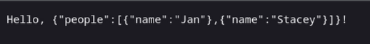

2. We willen nu op een GET request met url:  …/api/personen/2 alleen de gegevens van persoon met id=2 teruggeven. Gebruik de route parameter. Zie voorbeeld route: https://learn.microsoft.com/en-us/azure/azure-functions/functions-bindings-http-webhook-trigger?tabs=python-v2%2Cisolated-process%2Cnodejs-v4%2Cfunctionsv2&pivots=programming-language-javascript 

```js
const { app } = require('@azure/functions');

app.http('giveList', {
    methods: ['GET'],
    authLevel: 'anonymous',
    route: 'personen/{id}',
    handler: async (request, context) => {
        context.log(`Http function processed request for url "${request.url}"`);

        const id = parseInt(request.params.id, 10) -1;

        const list = {
            people:[
                {name: "Jan"},
                {name: "Stacey"}
        ]}
        const person = list.people[id];

        console.log("id: " + id);
        if(id === null) {
            return { body: `Hello, ${JSON.stringify(list)}!` };
        }
        else if(id > list.people.length || id < 0) {
            return {body: "Out of bounds"}
        }
        else {
            return { body: `Hello, ${JSON.stringify(person)}` };
        }
    }
});
```

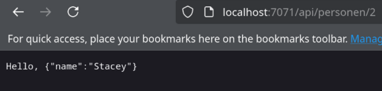

3. Geef een 404 terug als er geen persoon is met deze id.

```js
const { app } = require('@azure/functions');
const list = {
    people:[
        {name: "Jan"},
        {name: "Stacey"}
]}

app.http('giveList', {
    methods: ['GET'],
    authLevel: 'anonymous',
    route: 'personen/{id}',
    handler: async (request, context) => {
        context.log(`Http function processed request for url "${request.url}"`);

        const id = parseInt(request.params.id, 10) -1;

        const person = list.people[id];

        console.log("id: " + id);
        if(id === null) {
            return { body: `Hello, ${JSON.stringify(list)}!` };
        }
        else if(id > list.people.length || id < 0) {
            return {
                body: "404 | Person doesn not exist.",
                status: 404
            }
        }
        else {
            return { body: `Hello, ${JSON.stringify(person)}` };
        }
    }
});
```

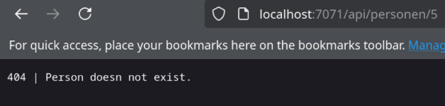

4. Maak de api voor het toevoegen van een persoon. Denk aan de REST regels. Test of op het GET request nu ook of deze persoon getoond wordt

```js
app.http('addPeople', {
    methods: ['POST'],
    authLevel: 'anonymous',
    route: 'personen',
    handler: async (request, context) => {
        context.log(`hoi :)`)
        context.log(`Http function processed request for url "${request.url}"`);

        let person = await request.json();
        context.log(`Person: ${person.name}`); 
        if(person === null) 
            return { status : 400 }
        
        let personName = person;
        list.people.push(personName);

        context.log(`Person name: ${personName}`);        
    }
});
```

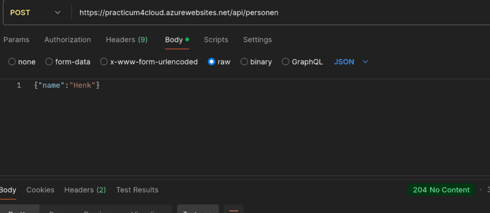

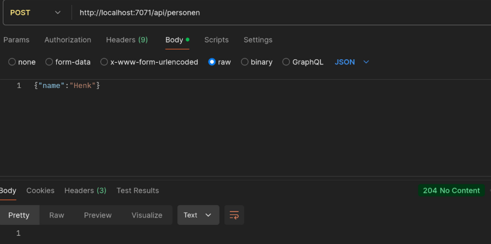

5. Idem voor wijzigen van een bestaand persoon

```js
app.http('modifyPeople', {
    methods: ['PUT'],
    authLevel: 'function',
    route: 'personen/{id}',
    handler: async (request, context) => {
        context.log(`Http function processed request for url "${request.url}"`);

        const id = parseInt(request.params.id, 10) -1;
        let person = await request.json();
        context.log(`Person: ${person.name}`); 

        if(id === null) {
            return { body: `Hello, ${JSON.stringify(list)}!` };
        }
        else if(id >= list.people.length || id < 0) {
            return {
                body: "404 | Person does not exist.",
                status: 404
            }
        }

        if(person === null) 
            return { status : 400 }
        
        let personName = person;
        list.people[id] = personName;
        console.log(`Person name: ${JSON.stringify(personName)}`);        
    }
});
```

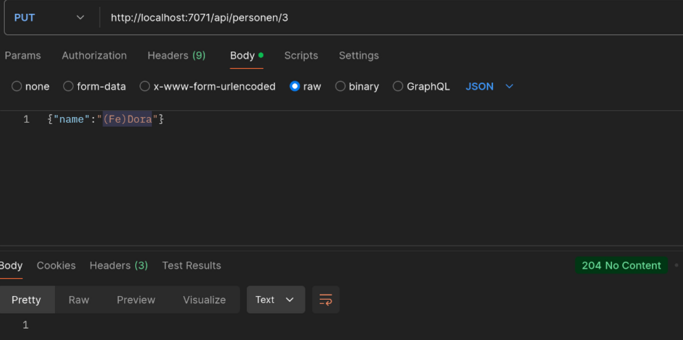

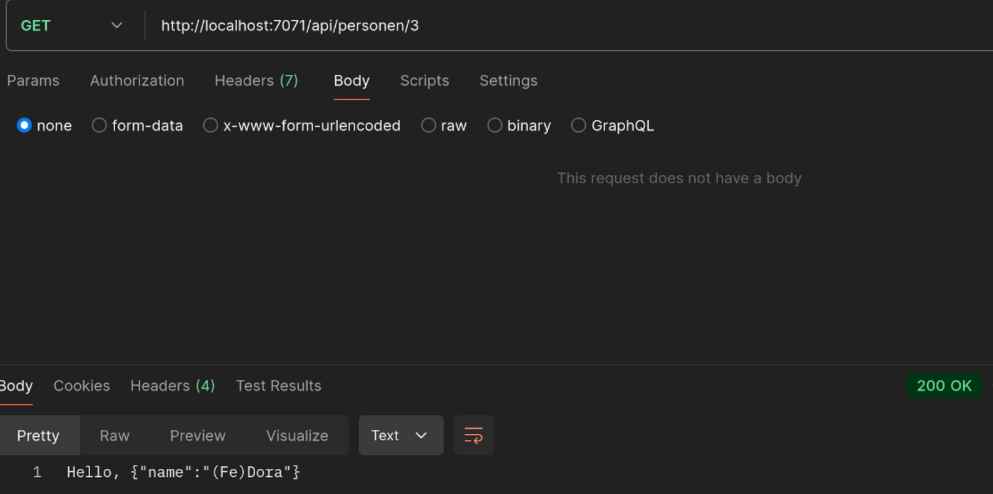

6. Idem voor het verwijderen van een persoon

```js
app.http('deletePeople', {
    methods: ['DELETE'],
    authLevel: 'anonymous',
    route: 'personen/{id}',
    handler: async (request, context) => {
        context.log(`Http function processed request for url "${request.url}"`);

        const id = parseInt(request.params.id, 10) -1;

        if(id === null) {
            return {
                status: 400         
            }
        }
        else if(id >= list.people.length || id < 0) {
            return {
                body: "404 | Person does not exist.",
                status: 404
            }
        }
        
        list.people.splice(id,1);   
    }
});
```

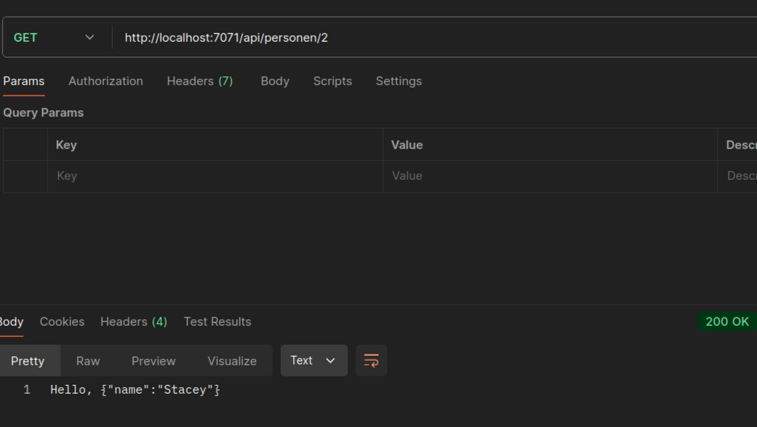

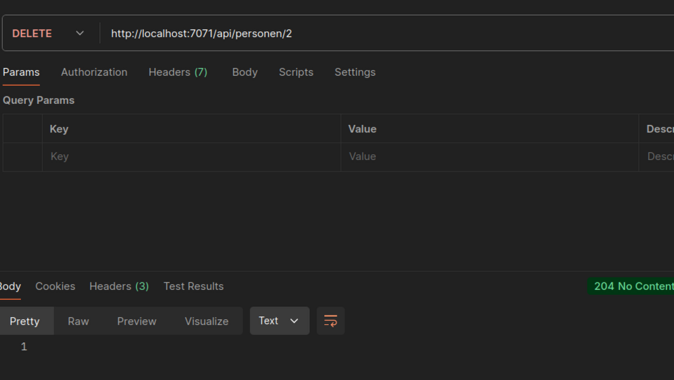

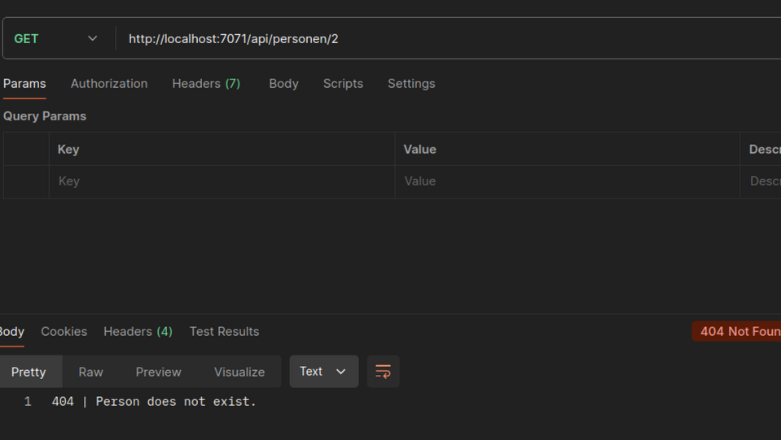

7. Deploy  de complete REST api naar Azure en test of deze werkt

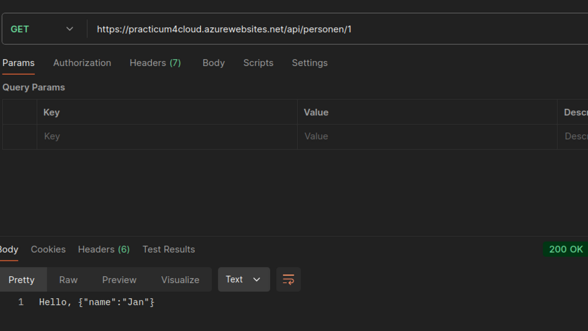

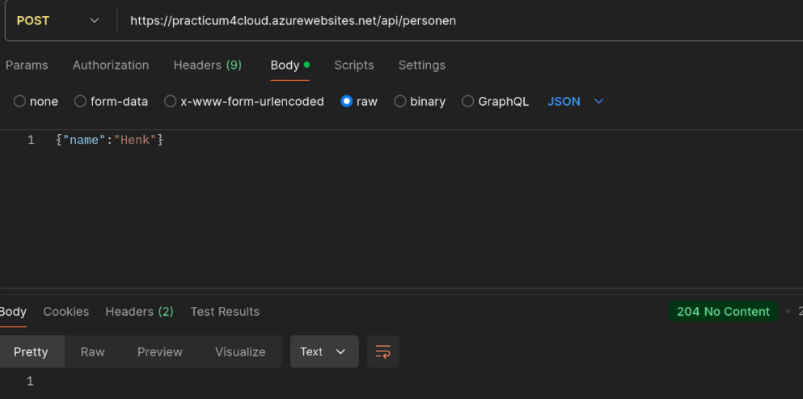

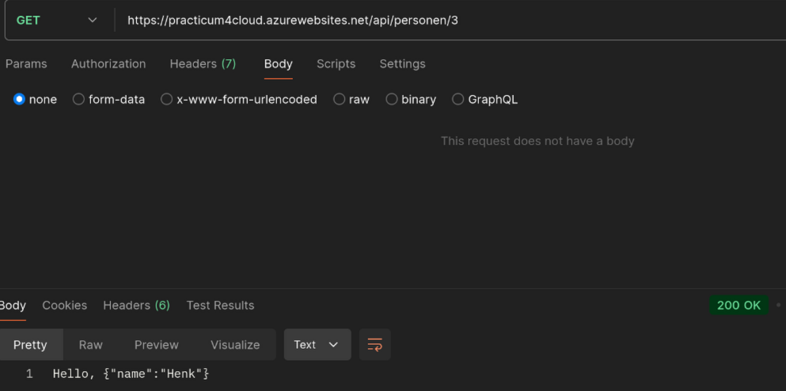

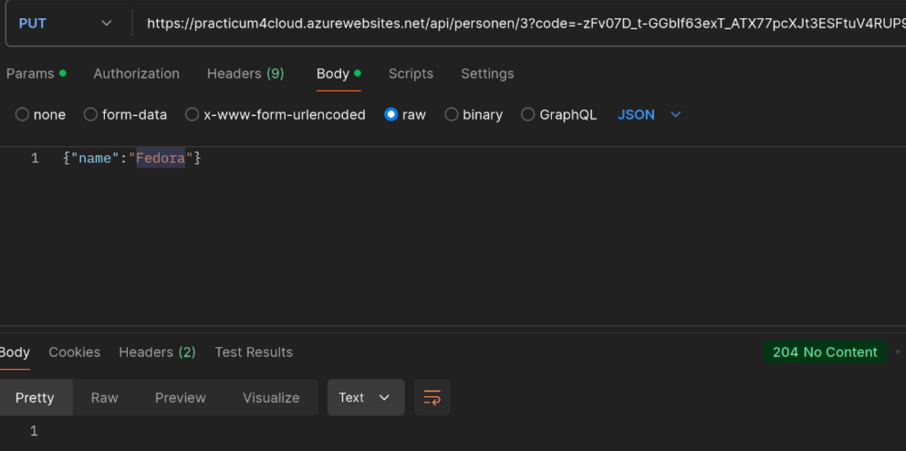

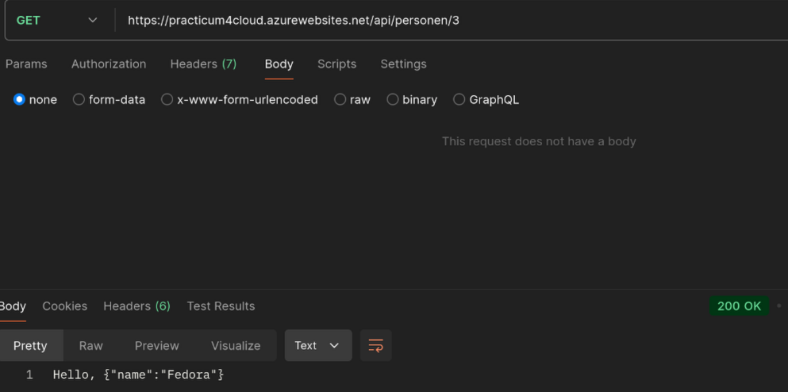

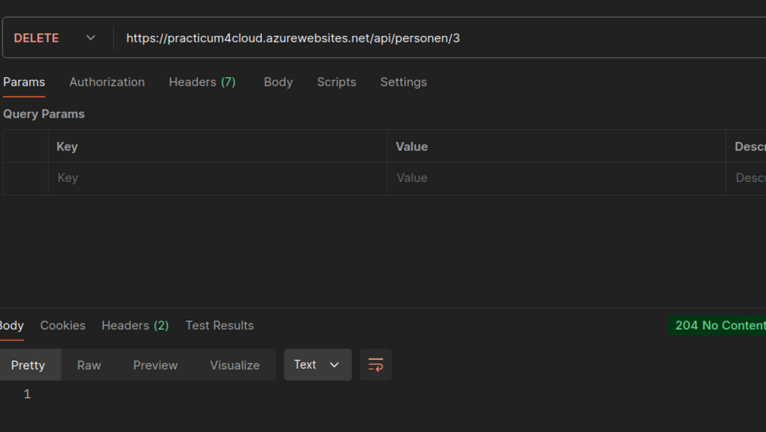

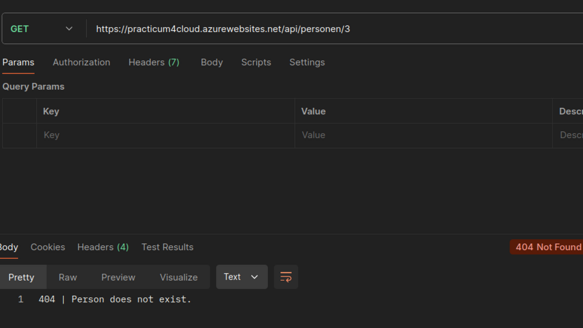

8. Hoe kan je voorkomen dat iedereen in de wereld deze REST api kan aanroepen

    Met AuthLevel kan je dat aanpassen. Dan moeten ze zich authenticaten.

9. Pas dit ook toe en test dit. Waar in Postman in het request heb je nu iets toegevoegd?

```js
app.http('giveList', {
    methods: ['GET'],
    authLevel: 'function', // <--- dit is verandert naar function van anonymous af
    route: 'personen/{id}',
    handler: async (request, context) => {
        context.log(`Http function processed request for url "${request.url}"`);

        const id = parseInt(request.params.id, 10) -1;

        const person = list.people[id];

        console.log("id: " + id);
        if(id === null) {
            return { body: `Hello, ${JSON.stringify(list)}!` };
        }
        else if(id >= list.people.length || id < 0) {
            return {
                body: "404 | Person does not exist.",
                status: 404
            }
        }
        else {
            return { body: `Hello, ${JSON.stringify(person)}` };
        }
    }
});
```

authLevel is verandert van `anonymous` naar `function` en de key van de azure function is meegegeven aan het request.

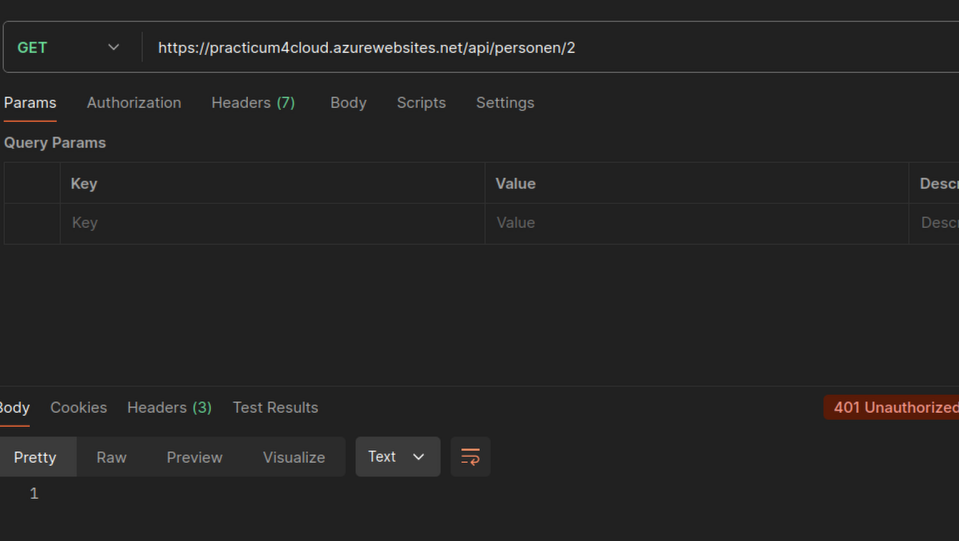

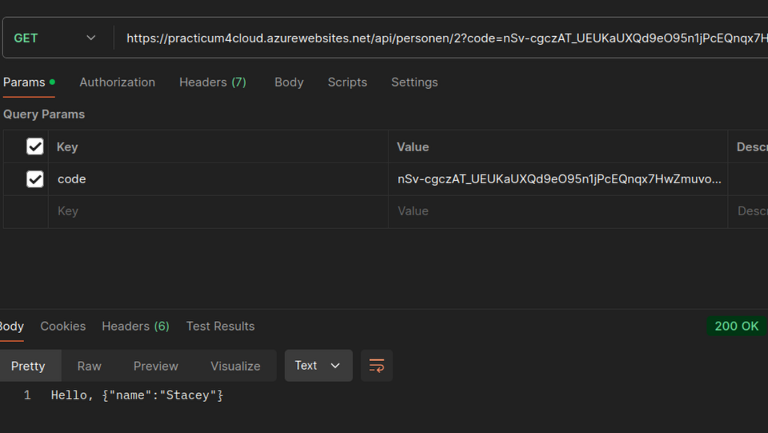

