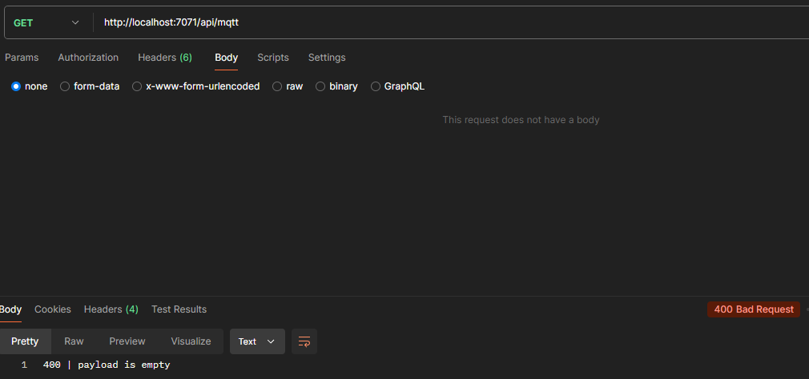

1.	Maak een azure function die een mqtt publish doet. De javacript code en het te gebruiken package zijn gelijk aan al eerder gemaakte code. Run en test deze function lokaal. Kijk in het mqtt dashboard of de publish is aangekomen.

```js
const mqtt = require('mqtt');
const brokerUrl = 'mqtt://broker.hivemq.com';
const topic = 'mqttIoTHHS';
const client = mqtt.connect(brokerUrl);

var globalPayload = JSON.stringify({
    "enable": true,
    "blinkDelayMs": 500,
    "rgbValue": {
        "red": 255,
        "green": 0,
        "blue": 0
    }
}, null, 2);

function sendMessage(topic, payload) {
    // publish message
    client.publish(topic, payload, (error) => {
        if (error) {
            console.error('Failed to publish message:', error);
        } else {
            console.log('Message published successfully');
        }
    });
}

app.http('mqttPublish', {
    methods: ['GET'],
    authLevel: 'anonymous',
    route: 'mqtt',
    handler: async (request, context) => {
        context.log(`Http function processed request for url "${request.url}"`);

        if (globalPayload === null)
            return { status: 500, body: "500 | methodName or payload are empty" }

        context.log(`global payload: ${globalPayload}`);

        sendMessage(topic, globalPayload);
    }
});
```


2. Maak nu REST api om het alarmlicht aan te sturen. De function ontvangt JSON met gegeven in welke kleur en frequentie het alarmlicht moet knipperen. Een Rest Api verwacht voor deze call een id, zodat hij weet welke resource hij moet aansturen. Alleen id =1 is geldig, geef anders een foutmelding richting de client dat de resource niet bestaat.

```js
const mqtt = require('mqtt');
const brokerUrl = 'mqtt://broker.hivemq.com';
const topic = 'mqttIoTHHS/';
const { app } = require('@azure/functions');
const client = mqtt.connect(brokerUrl);

const ids = {
    1: "alarmLicht",
}

var globalPayload = null;
var targetTopic = null;

function sendMessage(topic, payload) {
    // publish message
    client.publish(topic, payload, (error) => {
        if (error) {
            console.error('Failed to publish message:', error);
        } else {
            console.log('Message published successfully');
        }
    });
}

app.http('mqttPublish', {
    methods: ['GET'], // not completely sure this is the correct method for this, but I guess we are requesting data
    authLevel: 'anonymous',
    route: 'mqtt',
    handler: async (request, context) => {
        context.log(`Http function processed request for url "${request.url}"`);

        if (globalPayload === null)
            return { status: 400, body: "400 | payload is empty" }

        context.log(`global payload: ${globalPayload}`);

        try {
            sendMessage(targetTopic, globalPayload);
            return { status: 200, body: "200 | OK" }
        }
        catch {
            context.log(`global payload: ${globalPayload}`);
            return { status: 500, body: "500 | Failure sending message" }
        }
    }
});

app.http('createJSON', {
    methods: ['POST'],
    authLevel: 'anonymous',
    route: 'mqtt',
    handler: async (request, context) => {
        context.log(`Http function processed request for url "${request.url}"`);

        let payload = await request.json();
        context.log(`Payload: ${JSON.stringify(payload, null, 2)}`);
        if (payload === null)
            return { status: 400, body: "400 | payload could not be created" }

        // check if id exists
        if (ids.hasOwnProperty(payload.id)) {
            targetTopic = topic + ids[1]
        }
        else {
            targetTopic = null;
            return { status: 400, body: "400 | Resource does not exist" }
        }

        // remove id from json payload. Client has no need for it
        delete payload.id;

        // payload primed
        globalPayload = JSON.stringify(payload, null, 2);

        context.log(`global payload: ${JSON.stringify(globalPayload, null, 2)}`);

        return { status: 200, body: "200 | OK" }
    }
});

app.http('modifyJSON', {
    methods: ['PUT'],
    authLevel: 'anonymous',
    route: 'mqtt',
    handler: async (request, context) => {
        context.log(`Http function processed request for url "${request.url}"`);

        let payload = await request.json();
        context.log(`Payload: ${JSON.stringify(payload, null, 2)}`);
        if (payload === null)
            return { status: 400, body: "400 | payload could not be created" }

        if (ids.hasOwnProperty(payload.id)) {
            targetTopic = topic + ids[1];
        }
        else {
            targetTopic = null;
            return { status: 400, body: "400 | Resource does not exist" }
        }

        delete payload.id;

        globalPayload = JSON.stringify(payload, null, 2);

        context.log(`global payload: ${JSON.stringify(globalPayload, null, 2)}`);

        return { status: 200, body: "200 | OK" }
    }
});

app.http('deleteJSON', {
    methods: ['DELETE'],
    authLevel: 'anonymous',
    route: 'mqtt',
    handler: async (request, context) => {
        context.log(`Http function processed request for url "${request.url}"`);

        // reset topic and payload back to nothing
        targetTopic = null;
        globalPayload = null;

        // idk how it could happen, but to be safe
        if (globalPayload !== null)
            return { status: 500, body: "500 | payload could not be deleted" }
        else if (targetTopic !== null)
            return { status: 500, body: "500 | topic could not be deleted" }

        return { status: 200, body : "200 | OK" }
    }
});
```





3. Zorg nu dat er een hardcode lijst is met geldige id’s en welk topic bij dit id hoort. Nu kan je bijvoorbeeld 2 of meer verschillende alarmlampen aansturen via deze Rest Api. 

```js
const ids = {
    0: "all",
    1: "alarmLicht",
    2: "alarmLicht2"
}
```


4. Deploy nu deze function en test deze weer. Let op de package.json

Moest wel mqtt nog installeren om het deployen te laten werken


5. Maak een klein node.js programma  (dus geen function) dat een tekstbestand opent met het package fs en de inhoud print. Gebruik een callback functie en laat zien dmv een log melding dat de code asynchroon is

```js
const fs = require('fs');

console.log("Starting to read!");

fs.readFile('./very_secret_info.txt', 'utf8', (err, data) => {
    if (err) {
        console.error('Error reading file:', err);
        return;
    }

    console.log("Super secret information: ");

    console.log(data);
});

console.log("Finished Reading! (or am I?)");
```


6. Callbacks kunnen niet op deze manier in azure function. Er ontstaat dan het probleem dat Azure niet weet wanneer de function is afgelopen en wat de http response is. Gebruik nu await om een bestand te openen. Nu blijf je wachten voordat je naar de volgende regel code gaat. Je bruikt nu deze require: const fs = require('fs/promises');

```js
const fs = require('fs/promises');

async function readFile() {
    console.log("Starting to read!");

    try {
        const data = await fs.readFile('./very_secret_info.txt', 'utf8');
        console.log("Super secret information: ");
        console.log(data);
    } catch (err) {
        console.error('Error reading file:', err);
    }

    console.log("Finished Reading!");
}

readFile();
```


7. optioneel

8. Maak nu een function die een Azure Iot hub alarmlicht kan aansturen. Dit ging via een direct method aanroep. 

```js
app.http('AzurePublish', {
    methods: ['GET'], // not completely sure this is the correct method for this, but I guess we are requesting data
    authLevel: 'anonymous',
    route: 'mqtt/azure',
    handler: async (request, context) => {
        context.log(`Http function processed request for url "${request.url}"`);

        if (globalPayload === null)
            return { status: 400, body: "400 | payload is empty" }

        // context.log(`global payload: ${globalPayload}`);

        methodParams.payload = JSON.parse(globalPayload);

        // context.log(`method payload: ${methodParams.payload}`);
        context.log("type of payload: " + typeof methodParams.payload); // Outputs: object

        var client = Client.fromConnectionString(connectionString);

        client.invokeDeviceMethod(targetDevice, methodParams, function (err, result) {
            if (err) {
                console.error('Failed to invoke method \'' + methodParams.methodName + '\': ' + err.message);
                return { status: 500, body: "500 | Failure sending message" }
            } else {
                console.log(methodParams.methodName + ' on ' + targetDevice + ':');
                console.log(JSON.stringify(result, null, 2));
            }
        });

        client.close();
        return { status: 200, body: "200 | OK" }
    }
});
```


9. Maak nu een REST api waarin je zowel mqtt als iot hub alarmlicht kan aansturen. Deze zou je bijvoorbeeld kunnen gebruiken in een app. Let op! De gebruiker weet alleen het id van het aan te sturen alarmlicht. De function maakt de vertaling naar het correct mqtt of iot hub device. De administratie mag weer hardcoded zijn.

```js
const ids = {
    0: "all",
    1: "alarmLicht",
    2: "alarmLicht2",
    3: "azure_first_device",
}

async function azurePublish(context, request) {
    if (globalPayload === null)
        return { status: 400, body: "400 | payload is empty" }

    methodParams.payload = JSON.parse(globalPayload);

    // context.log(`method payload: ${methodParams.payload}`);
    context.log("type of payload: " + typeof methodParams.payload); // Outputs: object

    var client = Client.fromConnectionString(connectionString);

    client.invokeDeviceMethod(targetDevice, methodParams, function (err, result) {
        if (err) {
            console.error('Failed to invoke method \'' + methodParams.methodName + '\': ' + err.message);
            return { status: 500, body: "500 | Failure sending message" }
        } else {
            console.log(methodParams.methodName + ' on ' + targetDevice + ':');
            console.log(JSON.stringify(result, null, 2));
        }
    });

    client.close();
    return { status: 200, body: "200 | OK" }
}

async function mqttPublish(context, request) {
    if (globalPayload === null)
        return { status: 400, body: "400 | payload is empty" }


    context.log(`target topic: ${targetTopic}`);
    context.log(`global payload: ${globalPayload}`);

    try {
        sendMessage(targetTopic, globalPayload);
        return { status: 200, body: "200 | OK" }
    }
    catch {
        context.log(`global payload: ${globalPayload}`);
        return { status: 500, body: "500 | Failure sending message" }
    }
}

function sendMessage(topic, payload) {
    // publish message
    mqttClient.publish(topic, payload, (error) => {
        if (error) {
            console.error('Failed to publish message:', error);
        } else {
            console.log('Message published successfully');
        }
    });
}

app.http('mqttPublish', {
    methods: ['GET'], // not completely sure this is the correct method for this, but I guess we are requesting data
    authLevel: 'anonymous',
    route: 'mqtt/{id}',
    
    handler: async (request, context) => {
        context.log(`Http function processed request for url "${request.url}"`);

        const id = parseInt(request.params.id, 10);

        if (ids[id].includes("azure")) {
            targetDevice = targetDevice.replace(/^azure_/, '');
            context.log("azure runt");
            azurePublish(context, request);
        }
        else {
            context.log("mqtt runt");
            mqttPublish(context, request);
        }
    }
});

app.http('createJSON', {
    methods: ['POST'],
    authLevel: 'anonymous',
    route: 'mqtt/{id}',
    handler: async (request, context) => {

        const id = parseInt(request.params.id, 10);

        context.log(`id: ${ids[id]}`);

        context.log(`Http function processed request for url "${request.url}"`);

        let payload = await request.json();
        context.log(`Payload: ${JSON.stringify(payload, null, 2)}`);
        if (payload === null)
            return { status: 400, body: "400 | payload could not be created" }

        // check if id exists
        if (ids.hasOwnProperty(id)) {

            if (ids[id].includes("azure_")) {
                targetDevice = ids[id];
            } else {
                targetTopic = topic + ids[id]
            }
        }
        else {
            targetTopic = null;
            return { status: 400, body: "400 | Resource does not exist." }
        }

        // payload primed
        globalPayload = JSON.stringify(payload, null, 2);

        context.log(`global payload: ${JSON.stringify(globalPayload, null, 2)}`);

        return { status: 200, body: "200 | OK" }
    }
});
```


10.	Waarom heb je voor een app (of ander systeem) nu een mooi fascade pattern?

- Omdat de gebruiker niet kan zien of er intern mqtt of azure wordt gebruikt. Dit zit compleet voor hun verstopt.

11. Optioneel

12.	In een eerder practicum heb je een Iot Hub deur gemaakt. Deze geeft ook aan of hij al open stond enz.  Maak een nu een function om deze te openen en te sluiten waarbij in de http response in JSON de melding staat of hij al open stond in enz. Dus de terugmelding vanuit het Iot device ontvangt de aanroeper van de REST api ook. NB: Let op het correct gebruik van await.